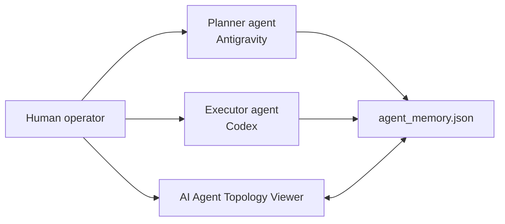

# AI Agent Topology Viewer

> A Tauri + React desktop control center for visualizing, supervising, and exporting AI-agent task graphs.
>
> 一款以 Tauri + React 建構的桌面控制中心，用來視覺化、監控並匯出 AI 代理任務圖。


---

## 拓撲橋接事件

AI Agent Topology Viewer 現在可以接收 FindAi Studio 引擎端產生的 `topology_state.json`。Tauri 會監聽預設 workspace 內的 `topology_state.json`，並向前端發送 `topology_updated` 事件；Activity Log 會記錄 session、節點數與錯誤數。

使用方式：

```powershell
$env:AGENT_WORKSPACE_DIR="D:\GitHub\LLM-Agent-System\workspace"
npm run tauri -- dev
```

接著在引擎 repo 執行：

```powershell
python agent_workspace/topology_stream.py stream --msg "test" --session verify-p1 --dry-run
```

這是新增能力，不會取代既有的 `agent_memory.json` 監聽流程。

## Topology Bridge Events

AI Agent Topology Viewer can now receive `topology_state.json` generated by the FindAi Studio engine side. Tauri watches `topology_state.json` in the default workspace and emits `topology_updated` to the frontend; the Activity Log records the session, node count, and error count.

Usage:

```powershell
$env:AGENT_WORKSPACE_DIR="D:\GitHub\LLM-Agent-System\workspace"
npm run tauri -- dev
```

Then run this from the engine repository:

```powershell
python agent_workspace/topology_stream.py stream --msg "test" --session verify-p1 --dry-run
```

This is additive and does not replace the existing `agent_memory.json` watcher.

## Phase 2 Topology View

The local Viewer material now includes the first Phase 2 topology surface:

- `useTopology()` loads `topology_state.json` through Tauri IPC and listens for `topology_updated`.
- `TopologyView` displays a session panorama with aggregate stats, a session selector, one or two React Flow DAG canvases, node documentation, and the existing Activity Log.
- Custom node components render `session_root`, `agent` / `handoff`, `tool_call`, and `hitl_gate` with the FindAi Studio semantic colors.
- Custom edge components render `handoff`, `tool`, `rbac` / `hitl`, and `error` paths with labeled directed edges.
- The original `TaskFlowView` remains available as fallback when no topology state has been loaded.

## 第二階段拓撲視圖

本機 Viewer 材料已加入第一版 Phase 2 拓撲操作介面：

- `useTopology()` 透過 Tauri IPC 載入 `topology_state.json`，並監聽 `topology_updated`。
- `TopologyView` 顯示 session 全景、總覽統計、session 選擇器、一或兩個 React Flow DAG、節點文件頁，以及既有 Activity Log。
- 自訂節點元件會以 FindAi Studio 語意色彩渲染 `session_root`、`agent` / `handoff`、`tool_call`、`hitl_gate`。
- 自訂邊元件會渲染 `handoff`、`tool`、`rbac` / `hitl`、`error` 的有向標籤邊。
- 尚未載入 topology state 時，原本的 `TaskFlowView` 仍作為 fallback 保留。

---

## 中文

### 專案定位

AI Agent Topology Viewer 是給人類與多個 AI 代理共同工作的任務控制台。它讀取每個 workspace 的 `agent_memory.json`，把任務、依賴、狀態與 AI 回饋渲染成 React Flow DAG。人類可以從 UI 監看進度、批准任務、修改描述、新增或刪除子任務，AI 代理則透過同一份 JSON 交換狀態。

適合搭配 Codex、Antigravity 或其他能讀寫檔案的 AI agent 使用。

### 目前功能

| 功能 | 說明 |
| --- | --- |
| 模組化前端架構 | `App.tsx` 保持 app shell，任務圖、設定、規則、MODs、onboarding、hooks 與 utils 已拆分 |
| Onboarding | 首次啟動引導建立第一個 workspace，並提示複製 AI 協作 prompt |
| JSON sanitize | 前端會 sanitize 不完整或不穩定的 AI JSON；Rust 端允許先回傳原始 JSON 交給前端修正 |
| React Flow DAG | 使用 dagre 自動 layout，支援任務依賴邊線、狀態顏色、highlight、dimmed state |
| 任務詳情面板 | 點擊節點後可查看 ID、描述、依賴與 `ai_feedback`，並可複製 AI 回饋 |
| 右鍵任務選單 | 支援編輯描述、新增子任務、複製任務 ID、標記狀態、刪除任務 |
| 搜尋與篩選 | 支援任務 ID、描述、AI 回饋搜尋，以及 `all` / `pending` / `in_progress` / `completed` 篩選 |
| 統計卡 | 顯示總任務、進行中、待處理、完成率 |
| Live Activity Log | 即時記錄 workspace 載入/同步、任務狀態、描述、新增、刪除與儲存錯誤 |
| 匯出功能 | 支援匯出 JSON 與 Markdown，包含 workspace metadata、stats、任務樹與 AI 回饋 |
| Settings tabs | 設定頁拆成一般設定、使用說明、AI 指南 |
| 多工作區 | 每個 workspace 可指定獨立路徑，對應自己的 `agent_memory.json` |
| 規則與 MODs | 可管理 AI 指令規則，並勾選技能提示詞產生 `AGENTS.md` |
| 主題與語言 | 支援中英文 UI，以及 dark、tokyo、light、forest、beige 主題 |

### 快速開始

#### 前置需求

- Node.js 20+
- Rust toolchain + Cargo
- Tauri v2 prerequisites
- Windows 為主要驗證平台

#### 安裝

```bash
git clone https://github.com/OPluke11-abula/ai-agent-topology-viewer.git
cd ai-agent-topology-viewer
npm install
```

#### 瀏覽器開發模式

```bash
npm run dev
```

#### Tauri 桌面模式

```bash
npm run tauri -- dev
```

#### 建置與檢查

```bash
npm run build
cd src-tauri
cargo check
```

> `npm run build` 目前可能出現 Vite chunk size warning，這是 bundle size 提示，不代表 build 失敗。

### JSON 格式

每個 workspace 對應一個 `agent_memory.json`：

```json
{
  "tasks": [
    {
      "id": "task-001",
      "description": "Describe the task",
      "status": "pending",
      "dependencies": [],
      "ai_feedback": "",
      "tasks": []
    }
  ]
}
```

#### 欄位說明

| 欄位 | 必填 | 說明 |
| --- | --- | --- |
| `id` | 是 | 任務唯一 ID，例如 `task-001` |
| `description` | 是 | 任務節點顯示的描述 |
| `status` | 是 | 只能是 `pending`、`in_progress`、`completed` |
| `dependencies` | 是 | 前置任務 ID 陣列 |
| `ai_feedback` | 否 | AI 完成後留下的摘要、風險或檔案變更 |
| `tasks` | 否 | 子任務陣列 |

前端會盡量 sanitize AI 產生的不完整 JSON，例如缺少 `dependencies`、`tasks` 或 `ai_feedback` 時仍可安全載入。

### AI 協作流程



1. 你要求規劃型 AI 拆任務，並寫入 workspace 的 `agent_memory.json`。
2. Viewer 監聽或載入 JSON，渲染任務圖。
3. 你在 UI 中把任務切成 `in_progress`，代表批准執行。
4. Codex 或其他執行型 AI 讀取 `in_progress` 任務並完成實作。
5. AI 將任務改成 `completed`，並在 `ai_feedback` 留下摘要。
6. 你透過 Viewer 檢查結果，繼續下一輪任務。

### 建議給規劃型 AI 的 prompt

```text
你是一位 AI 開發規劃師。請把需求拆成任務，並更新到：
D:\Projects\my-project\workspace\agent_memory.json

每個任務必須符合以下格式：
{
  "id": "task-001",
  "description": "任務描述",
  "status": "pending",
  "dependencies": [],
  "ai_feedback": "",
  "tasks": []
}

status 只能是 pending / in_progress / completed。
不要新增 title、design、findings 等自訂欄位。
```

### 建議給執行型 AI 的 prompt

```text
請讀取 D:\Projects\my-project\workspace\agent_memory.json。
尋找 status 為 in_progress 的任務並執行。
完成後，請把該任務 status 改為 completed，
並在 ai_feedback 寫下修改了哪些檔案、做了哪些驗證、仍有哪些風險。
```

### 匯出

Task Flow toolbar 提供兩種匯出：

- JSON：保留完整 `memory`、workspace metadata、統計數字，適合備份或交給其他工具處理。
- Markdown：輸出人類可讀的任務摘要、任務樹、依賴與 AI 回饋，適合貼到 issue、PR 或週報。

檔名格式：

```text
<workspace-name>-agent-memory-YYYY-MM-DD-HH-mm-ss.json
<workspace-name>-agent-memory-YYYY-MM-DD-HH-mm-ss.md
```

### 專案結構

```text
ai-agent-topology-viewer/
├── src/
│   ├── App.tsx
│   ├── constants.ts
│   ├── main.tsx
│   ├── types.ts
│   ├── components/
│   │   ├── ActivityLog.tsx
│   │   ├── ContextMenu.tsx
│   │   ├── Modal.tsx
│   │   ├── ModsView.tsx
│   │   ├── OnboardingWizard.tsx
│   │   ├── RulesView.tsx
│   │   ├── SettingsView.tsx
│   │   ├── Sidebar.tsx
│   │   ├── TaskFlowView.tsx
│   │   └── TaskNode.tsx
│   ├── hooks/
│   │   ├── useActivityLog.ts
│   │   ├── usePersistedState.ts
│   │   └── useWorkspace.ts
│   └── utils/
│       ├── exportUtils.ts
│       ├── graphUtils.ts
│       └── schemaValidator.ts
├── src-tauri/
│   └── src/lib.rs
├── .github/workflows/release.yml
├── package.json
└── README.md
```

### Tauri/Rust 端職責

- `load_agent_memory`
- `load_agent_memory_from`
- `save_agent_memory`
- `save_agent_memory_to`
- `save_workspace_file`
- 監聽預設 workspace 的 `agent_memory.json` 並發送 `agent_memory_updated`

前端 browser preview 沒有 Tauri IPC 時，`useWorkspace` 會使用 fallback memory，避免 preview 模式清空資料。

### 驗證策略

本專案的 UI 變更不能只看 build pass。建議至少跑：

```bash
npm run build
cd src-tauri
cargo check
```

對 Task Flow、搜尋/篩選、右鍵選單、Activity Log、匯出等 UI 變更，還應做 rendered UI 驗證。若 Browser plugin 不可用，可使用 Chrome/Edge headless + CDP fallback。

### 發佈

推送 `v*` tag 會觸發 GitHub Actions release workflow：

```bash
git tag v0.1.1
git push origin v0.1.1
```

Windows 安裝檔若尚未簽章，可能觸發 SmartScreen。這是未簽署開源桌面程式的常見情況。

### 授權

MIT License。詳見 [LICENSE](./LICENSE)。

---

## English

### What This Is

AI Agent Topology Viewer is a desktop control center for human-supervised multi-agent work. It reads each workspace's `agent_memory.json` file and renders tasks, dependencies, status, and AI feedback as a React Flow DAG. Humans can monitor progress, approve tasks, edit descriptions, add or delete subtasks, and export the graph. AI agents use the same JSON file to exchange state.

It is designed to work well with Codex, Antigravity, or any file-aware AI agent.

### Features

| Feature | Description |
| --- | --- |
| Modular frontend | `App.tsx` stays as the app shell; views, hooks, graph utilities, schema validation, and export helpers are split out |
| Onboarding | First-run flow for creating the initial workspace and copying an AI collaboration prompt |
| JSON sanitize | The frontend sanitizes incomplete AI-generated JSON; Rust returns raw JSON so the UI can recover safely |
| React Flow DAG | Dagre-powered layout with dependency edges, status styling, highlight, and dimmed search states |
| Task details panel | Click a node to inspect ID, description, dependencies, and `ai_feedback`; AI feedback can be copied |
| Node context menu | Right-click a task to edit, add subtasks, copy ID, change status, or delete |
| Search and filters | Search by task ID, description, or AI feedback; filter by all, pending, in progress, or completed |
| Stats cards | Total tasks, in progress, pending, and completion rate |
| Live Activity Log | Records workspace load/sync, task status edits, description edits, created/deleted tasks, and save errors |
| Export | Export JSON or Markdown with workspace metadata, stats, task tree, dependencies, and AI feedback |
| Settings tabs | General settings, usage guide, and AI guide |
| Multiple workspaces | Each workspace can point at its own `agent_memory.json` directory |
| Rules and MODs | Manage AI rules and selected skill prompts; generate `AGENTS.md` |
| Themes and languages | Chinese/English UI plus dark, tokyo, light, forest, and beige themes |

### Quick Start

#### Requirements

- Node.js 20+
- Rust toolchain + Cargo
- Tauri v2 prerequisites
- Windows is the primary validated platform

#### Install

```bash
git clone https://github.com/OPluke11-abula/ai-agent-topology-viewer.git
cd ai-agent-topology-viewer
npm install
```

#### Browser Development

```bash
npm run dev
```

#### Tauri Desktop Development

```bash
npm run tauri -- dev
```

#### Build and Check

```bash
npm run build
cd src-tauri
cargo check
```

> `npm run build` may currently show a Vite chunk size warning. That warning is about bundle size; it is not a build failure.

### JSON Schema

Each workspace maps to an `agent_memory.json` file:

```json
{
  "tasks": [
    {
      "id": "task-001",
      "description": "Describe the task",
      "status": "pending",
      "dependencies": [],
      "ai_feedback": "",
      "tasks": []
    }
  ]
}
```

#### Fields

| Field | Required | Description |
| --- | --- | --- |
| `id` | Yes | Unique task ID, for example `task-001` |
| `description` | Yes | Description displayed on the node |
| `status` | Yes | Must be `pending`, `in_progress`, or `completed` |
| `dependencies` | Yes | Array of prerequisite task IDs |
| `ai_feedback` | No | Summary, risks, or file changes left by the AI |
| `tasks` | No | Subtask array |

The frontend sanitizes missing or unstable fields, so incomplete AI output can still be loaded safely.

### AI Collaboration Workflow


1. Ask a planning agent to decompose work and write tasks into `agent_memory.json`.
2. The viewer loads or watches the JSON and renders the graph.
3. Mark a task as `in_progress` in the UI to approve execution.
4. Ask Codex or another executor agent to handle the in-progress task.
5. The executor marks it `completed` and writes a summary into `ai_feedback`.
6. Review the result in the viewer and start the next iteration.

### Prompt for a Planner Agent

```text
You are an AI development planner. Decompose the requirement into tasks and update:
D:\Projects\my-project\workspace\agent_memory.json

Each task must use this shape:
{
  "id": "task-001",
  "description": "Task description",
  "status": "pending",
  "dependencies": [],
  "ai_feedback": "",
  "tasks": []
}

status must be pending / in_progress / completed.
Do not add custom fields such as title, design, findings, etc.
```

### Prompt for an Executor Agent

```text
Read D:\Projects\my-project\workspace\agent_memory.json.
Find the task whose status is in_progress and execute it.
When finished, set that task status to completed and write which files changed,
which checks were run, and what risks remain in ai_feedback.
```

### Export

The Task Flow toolbar supports two export formats:

- JSON: includes the full `memory`, workspace metadata, and stats. Use this for backup or other tooling.
- Markdown: includes a human-readable summary, task tree, dependencies, and AI feedback. Use this for issues, PRs, or reports.

Filename format:

```text
<workspace-name>-agent-memory-YYYY-MM-DD-HH-mm-ss.json
<workspace-name>-agent-memory-YYYY-MM-DD-HH-mm-ss.md
```

### Project Structure

```text
ai-agent-topology-viewer/
├── src/
│   ├── App.tsx
│   ├── constants.ts
│   ├── main.tsx
│   ├── types.ts
│   ├── components/
│   │   ├── ActivityLog.tsx
│   │   ├── ContextMenu.tsx
│   │   ├── Modal.tsx
│   │   ├── ModsView.tsx
│   │   ├── OnboardingWizard.tsx
│   │   ├── RulesView.tsx
│   │   ├── SettingsView.tsx
│   │   ├── Sidebar.tsx
│   │   ├── TaskFlowView.tsx
│   │   └── TaskNode.tsx
│   ├── hooks/
│   │   ├── useActivityLog.ts
│   │   ├── usePersistedState.ts
│   │   └── useWorkspace.ts
│   └── utils/
│       ├── exportUtils.ts
│       ├── graphUtils.ts
│       └── schemaValidator.ts
├── src-tauri/
│   └── src/lib.rs
├── .github/workflows/release.yml
├── package.json
└── README.md
```

### Tauri/Rust Responsibilities

- `load_agent_memory`
- `load_agent_memory_from`
- `save_agent_memory`
- `save_agent_memory_to`
- `save_workspace_file`
- Watch the default workspace `agent_memory.json` and emit `agent_memory_updated`

When Tauri IPC is unavailable in browser preview mode, `useWorkspace` falls back to safe demo/empty memory instead of clearing real data.

### Validation Strategy

For code changes, run:

```bash
npm run build
cd src-tauri
cargo check
```

For UI changes touching Task Flow, search/filter, context menus, Activity Log, or export controls, also perform rendered UI validation. If the Browser plugin is unavailable, use a Chrome/Edge headless + CDP fallback.

### Release

Pushing a `v*` tag triggers the GitHub Actions release workflow:

```bash
git tag v0.1.1
git push origin v0.1.1
```

Unsigned Windows installers may trigger SmartScreen. This is common for unsigned open-source desktop apps.

### License

MIT License. See [LICENSE](./LICENSE).
